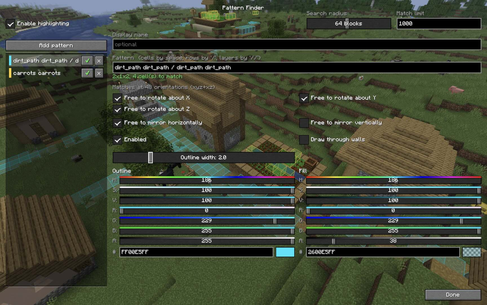

# Block Grep


**Minecraft 26.x; Fabric and NeoForge.**

Client-side mod that highlights every occurrence of a block pattern near you.

Patterns can be 1D, 2D or 3D, and you can search for shapes and groups of different
blocks, including any-block (`?`)

## Installation

Entirely client-side: the mod reads blocks the client has already been sent and
draws boxes locally. Nothing is transmitted, so it works on any server — the
server neither needs the mod nor knows it is there.

### Fabric

Requires the correct [fabric-api jar](https://modrinth.com/mod/fabric-api).

Copy [`blockgrep-fabric-X.X.X.jar`](https://github.com/tomgidden/minecraft-blockgrep/releases) to your `mods/` folder.

### NeoForge

Copy [`blockgrep-neoforge-X.X.X.jar`](https://github.com/tomgidden/minecraft-blockgrep/releases) to your `mods/` folder.

## Usage

The easiest way to configure the mod is using the GUI settings screen.  This can
be started with the command `/blockgrep config`, or you can go to
**Options → Controls → Key Binds → Block Grep** and assign "Open pattern settings" a key.

On Fabric, if you have **Mod Menu** installed, it'll appear in the mod menu list.

In the settings screen you can create new patterns and configure their rendering
settings.



### Commands

You can configure the mod entirely using commands if you wish.

```
/blockgrep pattern [symmetry] <spec>   add a shape of any dimensions
/blockgrep box <x> <y> <z> <blocks>    add a uniform box
/blockgrep list                        show the saved patterns
/blockgrep toggle <n>                  turn one on or off
/blockgrep only <n>                    enable one, disable the rest
/blockgrep all on|off                  every pattern at once
/blockgrep name <n> <text>             rename one
/blockgrep remove <n>                  delete one
/blockgrep radius <blocks>             4–128, default 32
/blockgrep limit <count>               default 512
/blockgrep config                      open the settings screen
/blockgrep status
/blockgrep off
```

### Pattern syntax

Patterns are made of cell predicates, each of which tries to match a block:

| Form | Meaning |
|---|---|
| `mud` | that block (namespace defaults to `minecraft`) |
| `mud,dirt` | Either mud or dirt |
| `mud,dirt,grass_block` | Either mud or dirt or a grass block |
| `#minecraft:trapdoors` | any block with that tag, ie. any trapdoor in this example |
| `?` | any block, including air |
| `!air` | anything the rest does not match |

These are combined into larger patterns using ` `, `|` and `||`.  So,

| Form | Meaning |
|---|---|
| `mud mud` | Two mud blocks beside each other (east-to-west) |
| `mud \| mud` | Two mud blocks beside each other (north-to-south) |
| `mud mud \| mud mud` | Four mud blocks in a 2x2 square |
| `mud,dirt mud,dirt \| mud,dirt mud,dirt` | Four blocks of mud-or-dirt in a 2x2 square |
| `stone stone \| stone stone \|\| mud mud \| mud mud` | A 2x2x2 cube with stone on the bottom layer and mud on the top layer |

#### Examples

* A 2x2 square of mud and/or dirt:
  * `/blockgrep box 2 1 2 mud,dirt`, or
  * `/blockgrep pattern mud,dirt mud,dirt | mud,dirt mud,dirt`
  
* A grass block above another grass block:
  * `/blockgrep pattern grass_block || grass_block`

* A 2x2 of mud, with anything (or nothing) above it:
  * `/blockgrep pattern mud mud | mud mud || ? ? | ? ?`

* Any 2x2 of logs, of any wood type:
  * `/blockgrep pattern #logs #logs | #logs #logs`

`/` and `//` work in place of `|` and `||`, but only with spaces around them,
because a `/` also appears inside tag ids — `#minecraft:mineable/pickaxe` is a
single cell. The bar form has no such restriction, so `mud mud|mud mud` is fine.

### Dimensioned form

A pattern can also be given as explicit dimensions followed by x·y·z cells, in
x then z then y order:

```
/blockgrep pattern 2 2 2 mud mud mud mud #logs ? ? #logs
```

### Symmetry

By default a pattern is matched at all four compass orientations. An optional
symmetry spec before the pattern changes that. It is up to three axis letters —
lowercase to allow rotation about that axis, uppercase or absent to pin it — with
`h` and `v` to allow horizontal and vertical mirroring.

```
/blockgrep pattern XYZ   mud ? | ? mud     only as written        (1)
/blockgrep pattern y     mud ? | ? mud     four compass turns     (4, the default)
/blockgrep pattern yh    mud ? | ? mud     ...plus horizontal flips  (8)
/blockgrep pattern yv    mud ? | ? mud     ...plus a top-to-bottom flip (8)
/blockgrep pattern yvh   mud ? | ? mud     both mirror families   (16)
/blockgrep pattern xyz   mud ? | ? mud     all 24 rotations of the cube
/blockgrep pattern xyzvh mud ? | ? mud    all 48, reflections included
```

Mirror planes can also be named individually after a `+`, by the axis normal to
each: `+x` is the east-west flip, `+y` the top-to-bottom one, `+z` north-south.
So `yh` is exactly `y+xz`, and `yv` is `y+y`.

Three things are worth knowing:

- Rotations about two different axes generate rotations about the third, so `xy`,
  `yz`, `xz` and `xyz` all mean the same 24 orientations.
- Reflections are **not** implied by rotations. An L-shape and its mirror image
  are different shapes however you turn them, which is why `h` and `v` exist.
- Mirrors are only interchangeable *because* of rotation. With the four turns of
  `y` in hand, `+x` and `+z` name the same eight orientations; with no rotation
  at all they are genuinely different flips, and `XYZ+xz` gives four orientations
  because composing the two mirrors produces a 180° turn.

Symmetric shapes are deduplicated, so each occurrence is reported once however
many orientations were searched.

## Performance

The scanner walks chunk sections (16x16x16 blocks) and uses the section palette
to reject sections that cannot contain any candidate block, which skips the
large majority of them. Scans are cached and re-run only when you move ~8 blocks
or every 2 seconds.

Sections are visited nearest-first, so a scan that hits the match limit reports
what is around you rather than whatever happened to lie in one corner of the
radius. The limit is shared between active patterns, so one very common pattern
cannot crowd out the others.

**Patterns containing `!` cannot use the section palette early-out and so are
correspondingly slower — prefer naming blocks explicitly where you can.**

Only chunks the client has loaded are searched, so range is capped by render distance
regardless of the `radius` setting.

## Cheating

**Note: this mod _can_ be used as an ore-finder so it should be considered a
bit cheaty.** Removing X-ray mode for a "lite" non-cheaty version was considered,
but you'd still be able to look for, say, valuable ore below a `grass_block` or
`stone`, highlighting that less-valuable block, so while removing X-ray mode
would limit bulk cheating, it wouldn't make it a fair non-cheaty mod to use.

## License and stuff

This mod is covered by the [MIT License](LICENSE.txt).

In short, you may freely use this mod in any modpack, but just don't claim you
made it. No promises, no warranties, so don't blame me if it breaks anything or
disadvantages you in some way, or you believe it did.

## AI Disclosure

This mod was developed with Claude AI, but it wasn't vibe-coded... every step
of development and every line of code was checked by me, and I wrote a
significant amount of it manually. Claude was mainly used for boilerplate,
bulk fixes and debugging.

[Comments and improvements welcome.](https://github.com/tomgidden/minecraft-blockgrep)

-- `_gid`


